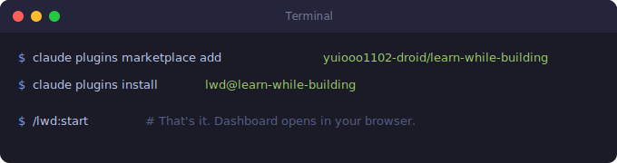
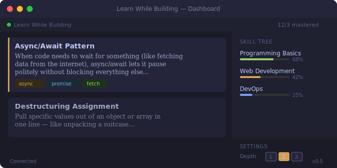
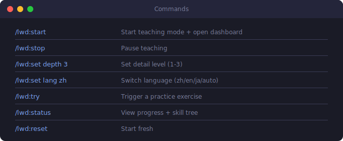

<div align="center">

# Learn While Building

**The AI builds your project. You learn programming. In real time.**

*A Claude Code plugin that turns every coding session into a live programming lesson.*
*No textbooks. No tutorials. Just real explanations of real code as it's being written.*

<br>



<br>

</div>

---

## The Problem

You're using AI to build software. It writes amazing code.

But you have **no idea** what any of it means.

You copy-paste. You ship. **You learn nothing.**

Learn While Building fixes this. Every time Claude writes code, you get a plain-English explanation of the programming concepts involved — delivered to a beautiful dashboard in your browser.

## Dashboard

<div align="center">



</div>

<br>

- **Live feed** — teaching cards appear in real time as Claude codes
- **Skill tree** — concepts organized by domain with progress bars
- **Search** — filter by keyword or concept (press `/` to focus)
- **Exercises** — answer directly in the dashboard
- **Today's summary** — track daily learning progress
- **Mobile friendly** — responsive layout with sidebar toggle

## Install

Two commands. That's it.

```bash
claude plugins marketplace add yuiooo1102-droid/learn-while-building
claude plugins install lwd@learn-while-building
```

No `npm install`. No config files. No setup wizards.

## Commands

<div align="center">



</div>

## What You'll Learn

As Claude builds your project, the dashboard explains:

| Domain | Concepts |
|--------|----------|
| **Fundamentals** | Variables, functions, loops, conditionals |
| **Async** | Promises, async/await, callbacks |
| **Web** | APIs, HTTP, REST, WebSocket |
| **Toolchain** | Git, npm, builds, testing |
| **Type System** | Types, interfaces, generics |
| **Patterns** | Design patterns, architecture, best practices |

Every concept is explained with **everyday analogies**, not jargon.

## How It Works

```
                                    ┌─────────────┐
                                    │   Browser    │
                                    │  Dashboard   │
                                    │  :3579       │
                                    └──────▲───────┘
                                           │ WebSocket
┌──────────────┐   PostToolUse    ┌────────┴────────┐
│  Claude Code │ ────────────────►│   LWB Server    │
│              │   hook event     │                 │
│              │◄─────────────────│ additionalCtx   │
│              │                  │                 │
│              │   POST /teach    │                 │
│              │ ────────────────►│ → broadcast ──► │
└──────────────┘   teaching JSON  └─────────────────┘
                                           │
                                  ~/.learn-while-building/
                                  ├── knowledge.json
                                  ├── config.json
                                  ├── archive.jsonl
                                  └── concept-map.json
```

Your knowledge state is tracked **locally** — nothing leaves your machine.

## For Developers

```bash
git clone https://github.com/yuiooo1102-droid/learn-while-building.git
cd learn-while-building
npm install
npm run build
npm test         # 14 test files, 87 tests
```

<details>
<summary><b>Project Structure</b></summary>

```
.claude-plugin/     Plugin metadata
.claude/skills/     6 slash commands (SKILL.md)
hooks/              PostToolUse + SessionStart hooks
src/server/         Fastify server + WebSocket
src/teaching/       Knowledge tracking, skill tree, exercises
src/web/            Browser dashboard (single HTML file)
dist/               Compiled JS (shipped with plugin)
tests/              Vitest test suite
```

</details>

## License

MIT
